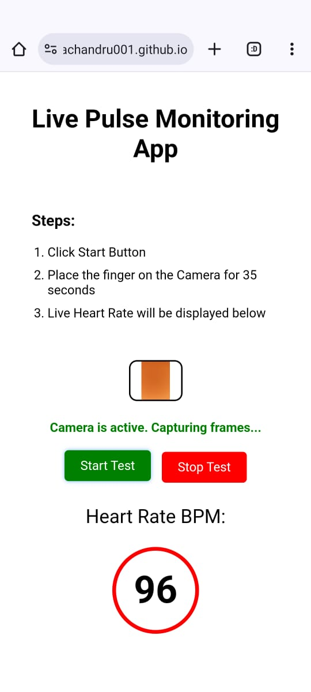

# LivePulseMonitoringApp-using-PPG

## Live Pulse Monitoring using Mobile Camera Web APP (Remote PPG)

This project focuses on developing a simple web application that utilizes the camera of mobile devices to monitor heart rate in real-time through remote photoplethysmography (PPG). By capturing subtle changes in skin color caused by blood flow, the app processes these visual signals to accurately measure pulse rates. The application aims to provide users with an accessible, non-invasive method to track their heart health anytime, anywhere. Hence, it is a valuable tool for personal health monitoring and remote patient care.

**Steps:**

1. Place the Finger on the Front Facing Camera (Make sure brightness screen is high and theme of the Browser in White Color)
2. Click the Start Button to proceed with pulse test.
3. Click Allow Permission to Access the Camera
4. Place the finger on the Front (Selfie) Camera for 35 sec.
5. Calulated Heart Rate will displayed in BPM (Beats Per Minute) after 10 sec
6. After 35 seconds Final Heart BPM is displayed.

### Advantages

* **Non-Invasive** : Comfortable and easy to use.
* **Accessibility** : Monitor heart rate anywhere.
* **Real-Time Monitoring** : Instant feedback on pulse.
* **Cost-Effective** : Affordable alternative to medical devices.
* **Remote Monitoring** : Facilitates telehealth options.

### Disadvantages

* **Accuracy Limitations** : Affected by lighting, camera quality and movement.
* **Tech Dependency** : Requires a smartphone and internet.
* **User Training** : May need guidance for effective use.
* **Environmental Factors** : External conditions can impact readings.
